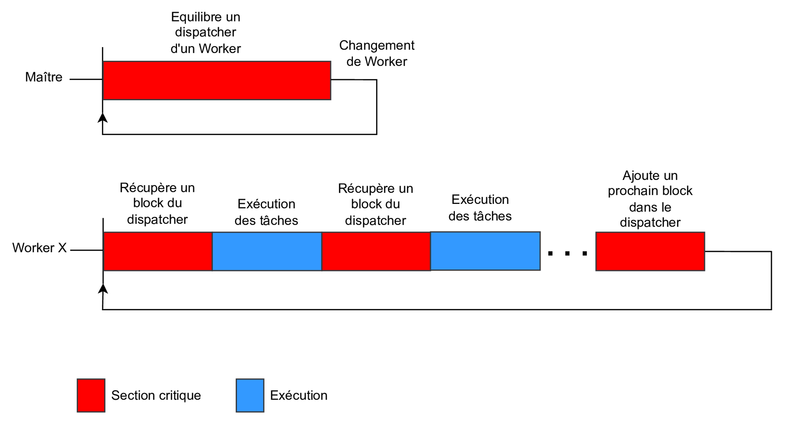
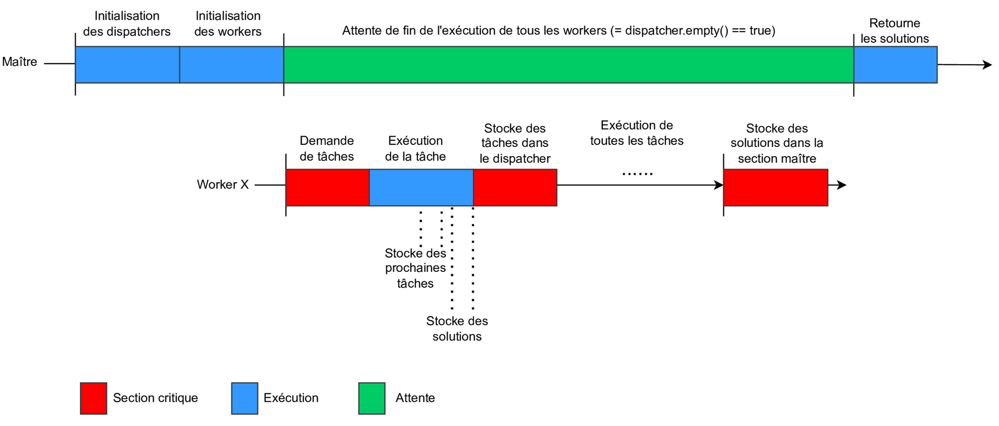
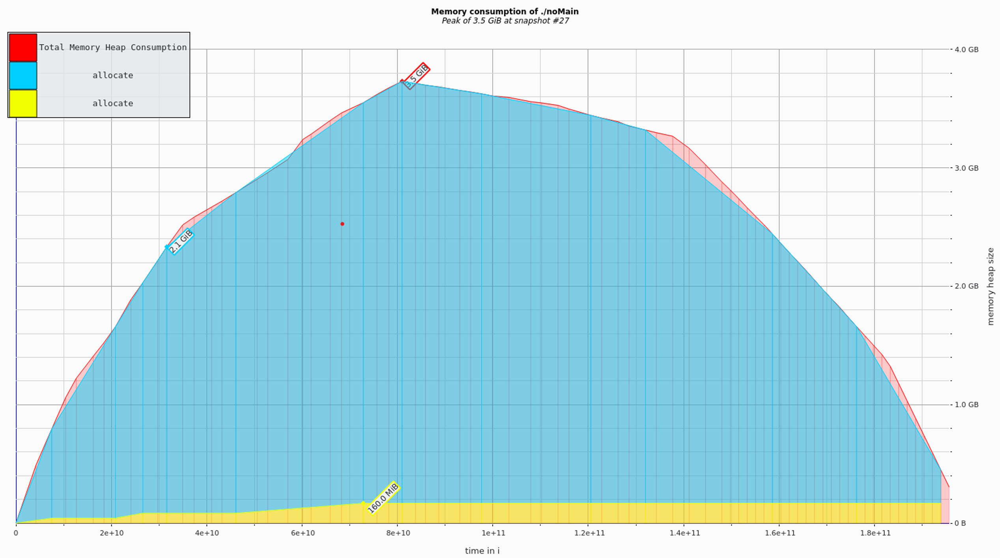
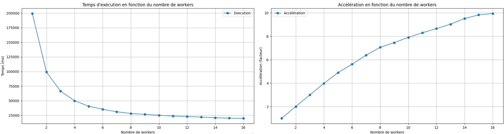
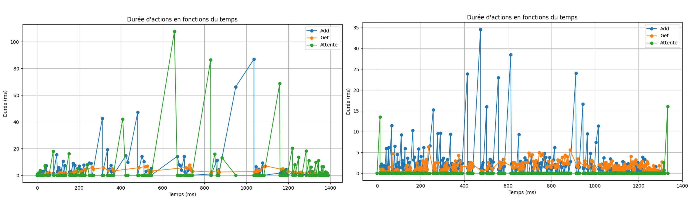

# Project CHPS0701 : Langford Pairing Problem (4th year - 1st semester)

Master's Degree in High-Performance Computing and Simulation
University of Reims Champagne Ardenne
2024

CHPS0701: Algorithm and parallel programming 

## Problem Statement

Langford’s problem (L(2, F)) aims to generate sequences of numbers from 1 to F such that each number k appears exactly twice, with k numbers between the two occurrences. The solution space grows rapidly with F, making it ideal for parallel exploration.

Example valid solution for F = 3:
```3, 1, 2, 1, 3, 2```

## Project Overview

Parallel Langford Solver is a parallelized C++ implementation of the Langford pairing problem using multiple task distribution strategies. The goal is to explore various parallel programming paradigms, including OpenMP and MPI, to efficiently solve a computationally intensive combinatorial problem. Several designs are tested, compared, and optimized in terms of execution time, memory usage, and scalability.

This project features algorithmic modeling, performance profiling using Intel VTune, and visualization via Python-based post-processing.

## Key Features

- Sequential and parallel implementations of the Langford problem
- Object-oriented design with customizable strategies
- Five task distribution strategies implemented:
  - Naive parallel tasks
  - Synchronized batch tasks
  - Regularized dispatchers
  - Static hybrid work sharing
  - MPI-based hybrid parallelism
- Modular code with template-based architecture
- Integrated data logging and metrics collection (time, memory, task balancing)
- Python scripts for generating performance dashboards

Theoretical approaches for the design of the different approaches:

|  |  |
|------------------------|------------------------|

Memory consumption measurements of the different approaches:

|  |
|------------------------|

Performance measures of the different approaches:

|  |
|------------------------|

Measurements at different key events to understand bottlenecks:

|  |
|------------------------|

## Project Structure

- code/ : Folder containing the various code elements
- ├── CMakeLists.txt: CMake file used for compiling
- ├── fullMain.cpp: Main file to solve the Langford problem by saving as much additional data as possible
- ├── lightMain.cpp: Main file to solve the Langford problem by saving the minimum amount of additional data There are essentially times to solve the problem.
- ├── noMain.cpp: Main file to solve the Langford problem without saving data and with minimal output to standard output.
- ├── *.py: Python code to post-process the saved information.
- ├── teste_openmp_multiple_worker.sh: Launch a test campaign to compare a strategy based on the number of threads. (Based on the main lightMain.cpp)
- ├── src/ : Source code of our library used by the main files
- ├── template/ : Templates used to generate HTML files
- └── documentation/ : Elements related to modeling
- resultats/ : Set of results obtained after running the various codes
- ├── resultats.xlsx: Excel files showing the main results
- ├── memory_report/ : Files viewable with massif
- └── *: The remaining folders contain the data saved during executions. You must open the index.html files. In addition, raw data contained in json files has been removed to reduce the size of the archive
- rapport/ : Folder containing the report and other

## Code

### Dependencies

### 1. C++ Dependencies

Before you can compile and run this project, you must install the following dependencies:

- **CMake** (version 3.12 or higher)
- **nlohmann_json** (JSON library for C++)
- **RapidJSON** (JSON library for C++)
- **OpenMP** (support for parallelization with OpenMP)
- **MPI** (support for parallelization with MPI)

To install **nlohmann_json** and **RapidJSON**, you can run the following command:

```bash
sudo apt install nlohmann-json3-dev rapidjson-dev
```

### 2. Python Dependencies

Python scripts require the following libraries:

- `matplotlib`
- `numpy`
- `jinja2`

To install the libraries, run the following command:

```bash
pip install matplotlib numpy jinja2
```

### Compilation

To compile the project:

1. From the code directory, create a build directory:

```bash
mkdir build
cd build
```

2. Run the CMake command to configure the project:

```bash
cmake ..
```

3. Compile the project:

```bash
make
```

This will generate the following executables:
- fullMain
- lightMain
- noMain

4. To have the Dependencies

Call the target that will generate dependencies for using scripts and other things.

```bash
make all_required_depends
```

5. To configure the Langford problem

Choose the main file you want to use (fullMain.cpp, lightMain.cpp, noMain.cpp), then open it and modify the value of the F variable to change the frequency. To change the strategy used, comment out the line that defines the Resolver type, then uncomment the line that uses your strategy.

Then you can recompile your target.

### Execution

To run the noMain file.

```bash
./noMain
```

To run the lightMain file, pass the output directory path of the generated files as a parameter.

```bash
./lightMain output/light
```

To run the fullMain file, pass the output directory path of the generated files as a parameter.

```bash
./fullMain output/full
```

If you are using a strategy implemented with OpenMP, you can change the number of threads with the following command.

```bash
export OMP_NUM_THREADS=X
```

If you are using a strategy implemented with MPI, you must run your program with mpirun -np X preceding it.

```bash
mpirun -np X ./lightMain output/light
```

### Running Custom Targets

The various custom targets allow you to run a program to apply post-processing to the generated data.

1. Generate the Necessary Files

To have the scripts in your build directory, you can call the following target.

```bash
make all_required_depends
```

The following targets will only work if the chosen strategy does not rely on MPI, unless otherwise specified.

To call, execute the lightMain file and generate an HTML file and graphics file to read the data. You can run the following target; the generated files will be located in the output/light folder.

```bash
make run_light_tracker
```

To call, execute the fullMain file and generate an HTML file and graphics file to read the data. You can run the following target; the generated files will be located in the output/full folder. Be careful, if the Langford error frequency is high, it may cause excessive memory usage and a long time to store data and generate HTML and graphics files.

```bash
make run_full_tracker
```

To call run the fullMain file and generate an HTML file without graphics to read the data. You can run the following target; the generated files will be located in the output/full folder. Be careful, if the Langford error frequency is high, it may cause excessive memory usage and a long time to store data and generate HTML files. The time required is shorter than that of the run_full_tracker target.

```bash
make run_full_no_graph_tracker
```

To run a test campaign to test the number of threads based on a strategy implemented with MPI, you can run the teste_mpi_multiple_worker.sh script. As a parameter, you must pass the minimum number of threads followed by the maximum; the increment is 1. Then, pass the output directory. The file used to view the comparison is located in the output directory. Finally, the results for a specified thread are located in folders of the form light_*/.

```bash
./teste_openmp_multiple_worker.sh 1 12 output/
```

To run a test campaign to test the number of processes based on a strategy implemented with MPI, you can run the teste_mpi_multiple_worker.sh script. As a parameter, you must pass the minimum number of threads followed by the maximum; the increment is 1. Next, pass the output directory. The file used to view the comparison is located in the output directory. Finally, the results for a specified thread are located in the light_*/ folders. Note that this is the only target that can be called if the implementation is based on MPI.

```bash
./teste_mpi_multiple_worker.sh 1 12 output/
```

To delete the contents of the output/, output/full, and output/light directories, you can call the following target.

```bash
make clean_base_output_directory
```

To delete all generated files, call the following target.

```bash
make clean
```

### Using External Tools

This section explains how to use Intel VTune and Valgrind to profile and analyze program performance.

1. Profiling with Intel VTune

Before using Intel VTune and after installing it, you must configure your environment by running the following command:

```bash
source /opt/intel/oneapi/vtune/latest/vtune-vars.sh
```

You can use VTune to collect a set of data.

This command collects information about the program's thread usage:

```bash
vtune -collect threading -- ./noMain
```

This command identifies the areas of your code where execution time is highest (hotspots):

```bash
vtune -collect hotspots -- ./noMain
```

To view the analysis results with a graphical interface, run the following command:

```bash
vtune-gui
```

2. Memory Analysis with Valgrind

Use Valgrind's Massif tool to analyze your program's memory consumption:

```bash
valgrind --tool=massif ./noMain
```

This command generates an output file containing memory usage data. The name of the generated file will be in the form massive.out.<pid>, where <pid> is the process ID.

To view the memory analysis results, use Massif-Visualizer:

```bash
massif-visualizer massive.out.203819
```

Replace massive.out.203819 with the name of the output file generated by Valgrind.

## Resources

For complete explanations, diagrams, and strategy comparisons, see the project report (in French): [Project Report (PDF & French)](./rapport/CHPS0701_rapport_KRUK_Timothe.pdf)
